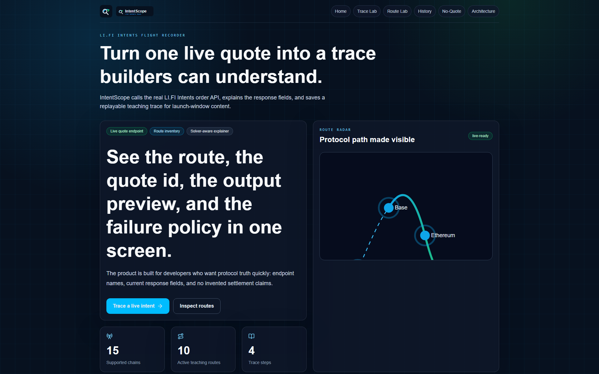
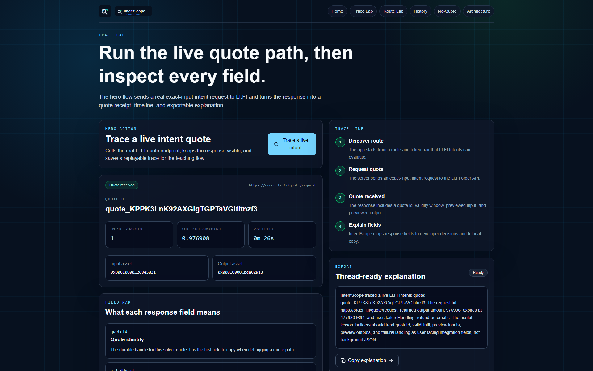
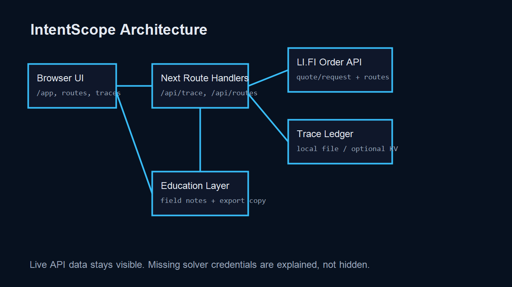

<p align="center"></p>

<p align="center">
  <b>IntentScope</b> — Live LI.FI Intents traces builders can read.
</p>

<p align="center">
  <a href="https://intentscope.veithly.workers.dev"></a>
  <a href="docs/demo/intentscope-demo.webm"></a>
  <a href="LICENSE"></a>
  <a href="https://nextjs.org"></a>
  <a href="https://docs.li.fi/lifi-intents/introduction"></a>
</p>

<p align="center">
  
</p>

## Why IntentScope

LI.FI Intents are easier to understand when a builder can see the live request path. IntentScope calls the real order API, turns the quote response into a readable trace, and keeps every important field visible: `quoteId`, validity, input preview, output preview, solver metadata, and failure handling.

## What It Does

Open the app, click **Trace a live intent**, and IntentScope sends a real exact-input request to `POST /quote/request`. The returned quote becomes a receipt with the quote id, output amount, validity window, and field-level explanations. The trace is saved so the same response can be reopened and turned into short teaching copy.

The Route Lab loads active route inventory from LI.FI's route endpoint and explains the solver-facing fields that matter before a builder asks for credentials. The no-quote playground preserves an empty `quotes` response and explains how to reason about it instead of hiding it.

<p align="center">
  
</p>

## Architecture

IntentScope is a small Next.js App Router project with server-side API proxies for LI.FI endpoints and a local trace ledger that can map to Cloudflare KV in production. The browser never receives private credentials, and the app does not claim wallet settlement or solver submission. Read the engineering details in [docs/ARCHITECTURE.md](docs/ARCHITECTURE.md).

<p align="center">
  
</p>

## Quick Start

```bash
npm install
npm run dev
```

Open `http://localhost:3000`, then click **Trace a live intent**.

Live deployment: `https://intentscope.veithly.workers.dev`

Recorded demo: [`docs/demo/intentscope-demo.webm`](docs/demo/intentscope-demo.webm)

Optional local variables:

```bash
LIFI_ORDER_API_BASE=https://order.li.fi
LIFI_ORDER_DEV_API_BASE=https://order-dev.li.fi
```

## Verification

```bash
npm run build
npm run test:e2e
npm run audit:prd
npm run audit:ui
npm run audit:density
npm run audit:realness
```

## License

MIT © IntentScope contributors.
